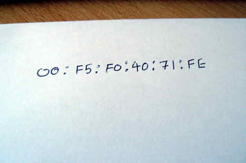

---
title: Changing the MAC address
...

Introduction (GM45)
===================

On all laptops with the GM45 chipset (T400,R400,T500,X200,X200S,X200T),
the [MAC address](https://en.wikipedia.org/wiki/MAC_address)
for the built-in gigabit ethernet controller is stored inside the flash chip,
along with Libreboot and other configuration data.

Prebuilt Libreboot for these laptops contains a generic
MAC address in the configuration section. This address is `00:f5:f0:40:71:fe`
in builds before 2018-01-16 and `00:4c:69:62:72:65` afterwards.
Unless you change it, your computer will boot and use it. This can lead
to network problems if you have more than one Libreboot computer on
the same layer2 network (e.g. on the same network switch).

To prevent these address clashes, you can either modify prebuilt Libreboot
to use an address of your own choosing or you can change the address in your
operating system's boot scripts.

In either case, it is a good idea to write down the address that your
computer originally had.

Obtaining the existing MAC address
==================================

The existing MAC address may be obtained by the following methods:

1.  Read the white label on the bottom of the case. Note that this will only
    produce the correct address, if your motherboard has never been replaced.
    Examples:

    
    
    
    

2.  Run `ip link` or `ifconfig` in a terminal/console/shell;
    look for your ethernet device (e.g., **enpXXX** in Arch-based distributions,
    or **eth0** in Debian-based distributions),
    and look for a set of colon-delimited hexadecimal (base 16) digits:
    0,1,2,3,4,5,6,7,8,9,aA,bB,cC,dD,eE,fF. For example: `00:f3:f0:45:91:fe`.

    * `$ ip link`

         `... link/ether ??:??:??:??:??:?? brd ...`

    * Alternatively:

        `$ ifconfig`

        `... ether ??:??:??:??:??:?? txqueuelen ...`

Changing the MAC address in the operating system
================================================

There are three portable ways of doing so:

1.  Using the new iproute2 package:

    `# ip link set <interface> down`

    `# ip link set dev <interface> address 00:4c:69:62:72:65`

    `# ip link set <interface> up`

2.  Using the old `ifconfig` command:

    `# ifconfig <interface> hw ether 00:4c:69:62:72:65`

3. Using the macchanger package.

You can use use of these three methods in your operating system's
init scripts or you can use your operating system's own networking
configuration. Refer to your operating system's documentation for
how to do this.

Changing the MAC address in Libreboot
=====================================

See [here](../gnulinux/grub_cbfs.md#changeMAC).

Copyright © 2017 Fedja Beader <fedja@protonmail.ch>

Copyright © 2014, 2015 Leah Rowe <info@minifree.org>

Permission is granted to copy, distribute and/or modify this document
under the terms of the GNU Free Documentation License Version 1.3 or any later
version published by the Free Software Foundation
with no Invariant Sections, no Front Cover Texts, and no Back Cover Texts.
A copy of this license is found in [../fdl-1.3.md](../fdl-1.3.md)
