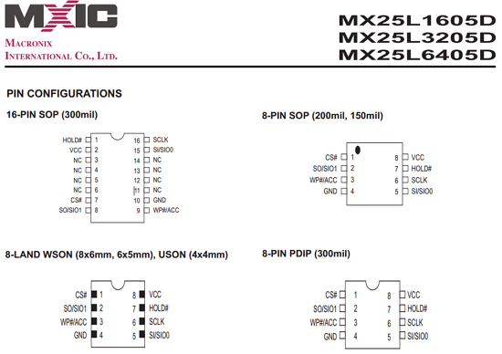
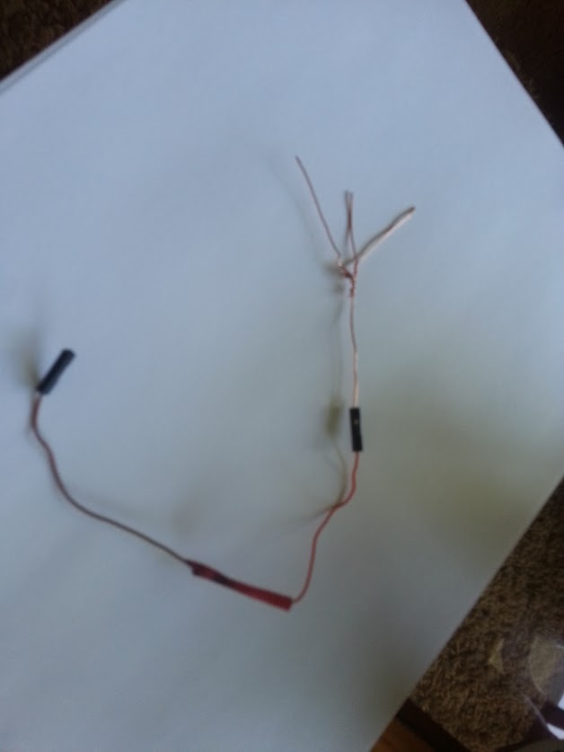
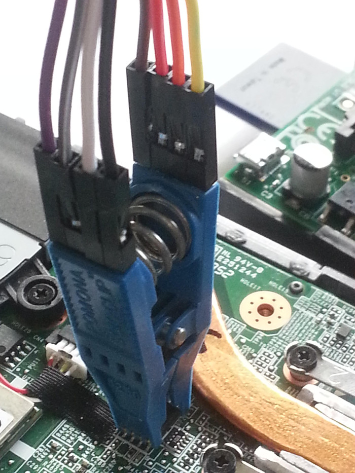
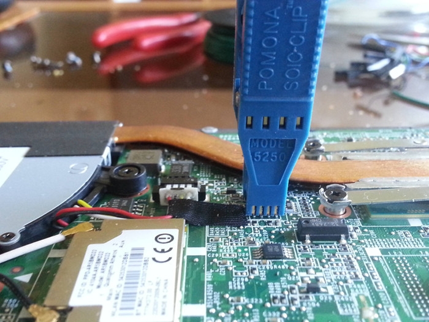

---
title: How to program an SPI flash chip with the Raspberry Pi 
...

This document exists as a guide for reading from or writing to an SPI
flash chip with the Raspberry Pi, using the
[flashrom](http://flashrom.org/Flashrom) software. Most revisions of the
RPi should work.

The Libreboot project recommends using
[blobless GNU/Linux](https://blog.rosenzweig.io/blobless-linux-on-the-pi.html)
on the Raspberry Pi, to avoid having to run non-free software. This
only became possible in February 2017 and the instructions below are
not yet updated with the necessary steps, so please do not follow the
steps below unless you are willing to run non-free software on your
Raspberry Pi.

This only covers SOIC-8 flash chips, for now. SOIC-16 guide coming later
(for now, it should be easy enough for you to figure this out for
SOIC-16).

{#user-content-raspberry-pi-thinkpad-x60t60-and-macbook-21 .anchor}Raspberry Pi (ThinkPad X60/T60 and Macbook 2,1)
------------------------------------------------------------------------------------------------------------------------------------------------------------------

The Raspberry Pi (a multipurpose \$25 GNU+Linux computer) can be used as
a BIOS flashing tool, thanks to its GPIO pins and SPI support.

> **Note:** The Raspberry Pi Model A is not supported, since it has no
> GPIO pins.

### {#user-content-disassembling-the-thinkpad .anchor}Disassembling the ThinkPad

Follow the [X60 Hardware Maintenance
Manual](http://download.lenovo.com/ibmdl/pub/pc/pccbbs/mobiles_pdf/42x3550_04.pdf)
or [T60 Hardware Maintenance
Manual](http://download.lenovo.com/ibmdl/pub/pc/pccbbs/mobiles_pdf/42t7844_04.pdf)
to disassemble the laptop, until you can access the BIOS chip.

For photos, follow the [Libreboot T60 Recovery
Guide](t60_unbrick.html).

-   On the X60, the BIOS chip is on the bottom of the motherboard, under
    a layer of protective black tape.

-   On the T60, the BIOS chip is just under the palmrest, but blocked by
    a magnesium frame (which you will have to remove).

### {#user-content-pomona-clip-pinout .anchor}Pomona Clip Pinout

Diagram of the 26 GPIO Pins of the Raspberry Pi Model B (for the Model
B+ with 40 pins, start counting from the right and leave 14 pins):

 

     8-pin for X60:

    ~~~~ LCD (Front) ~~~~
            8765
            ----
            |  |
            ----
            1234
    ~~~ Palmrest (back) ~~

  Pin \#   SPI Pin Name   BP (Seeed)   BP (Spkfun)   [Beagleboard Black](http://beagleboard.org/Support/bone101#headers)   [Raspberry Pi](images/rpi/0000.jpg)
  -------- -------------- ------------ ------------- --------------------------------------------------------------------- -------------------------------------
  1        CS             White        Red           Pin 17                                                                24
  2        MISO           Black        Brown         Pin 21                                                                21
  3        *not used*     *not used*   *not used*    *not used*                                                            *not used*
  4        GND            Brown        Black         Pin 1                                                                 25
  5        MOSI           Gray         Orange        Pin 18                                                                19
  6        CLK            Purple       Yellow        Pin 22                                                                23
  7        *not used*     *not used*   *not used*    *not used*                                                            *not used*
  8        3.3V           *red*        White         [3.3V PSU RED](bbb_setup.html)      17

Make sure the pinouts are correct; otherwise, Flashrom will fail to
detect a chip, or it will "detect" a `0x0` chip. Finally, make sure
that the Pomona clip makes contact with the metal wires of the chip. It
can be a challenge, but keep trying.

### {#user-content-how-to-supply-power-to-the-flashchip .anchor}How to supply power to the flashchip

There are two ways to supply power to the chip: plugging in an AC
adapter (without turning the laptop on), and using the 8th 3.3v pin.

I have found that the SST chips work best with the 8th pin, while the
Macronix chips require an AC Adapter to power up.

**Never connect both the 8th pin and the AC adapter at the same time.**

Your results may vary.

{#user-content-reading-the-flashchip .anchor}Reading the Flashchip
--------------------------------------------------------------------------------------------

First, visually inspect (with a magnifying glass) the type of flashchip
on the motherboard.

Next, download and compile the latest Flashrom source code on the
Raspberry Pi.

    sudo apt-get install build-essential pciutils usbutils libpci-dev libusb-dev libftdi1 libftdi-dev zlib1g-dev subversion
    svn co svn://flashrom.org/flashrom/trunk flashrom
    cd flashrom
    make
    sudo modprobe spi_bcm2708
    sudo modprobe spidev

If your chip is an SST, run this command:

    sudo ./flashrom -p linux_spi:dev=/dev/spidev0.0 -r test.rom

If your chip is a Macronix, run this command:

    sudo ./flashrom -c "MX25L1605" -p linux_spi:dev=/dev/spidev0.0 -r test.rom

Next, check the md5sum of the dump:

    md5sum test.rom

Run the `flashrom` command again to make a second dump. Then, check the
md5sum of the second dump:

    md5sum test.rom

If the md5sums match after three tries, `flashrom` has managed to read
the flashchip precisely (but not always accurately). You may try and
flash Libreboot now.

{#user-content-flashing-libreboot .anchor}Flashing Libreboot
-----------------------------------------------------------------------------------

> **Note:** replace `/path/to/libreboot.rom` with the location of your
> chosen ROM, such as `../bin/x60/libreboot_usqwerty.rom`):

If your chip is an SST, run this command:

    sudo ./flashrom -p linux_spi:dev=/dev/spidev0.0 -w /path/to/libreboot.rom

If your chip is a Macronix, run this command:

    sudo ./flashrom -c "MX25L1605" -p linux_spi:dev=/dev/spidev0.0 -w /path/to/libreboot.rom

Once that command outputs the following, the flash has completed
successfully. If not, just flash again.

    Reading old flash chip contents... done.
    Erasing and writing flash chip... Erase/write done.
    Verifying flash... VERIFIED.

### {#user-content-sources .anchor}Sources

-   [Scruss - Simple ADC with the Raspberry
    Pi](http://scruss.com/blog/2013/02/02/simple-adc-with-the-raspberry-pi/)
-   [Flashing coreboot on a T60 with a Raspberry Pi -
    the\_unconventional's
    blog](https://blogs.fsfe.org/the_unconventional/2015/05/08/flashing-coreboot-on-a-t60-with-a-raspberry-pi/)
-   **Pomona SOIC Clip flashing**
    -   [Arch Linux Wiki - Installing Arch Linux on
        Chromebook](https://wiki.archlinux.org/index.php/Chromebook)
    -   [Google Drive - Raspberry Pi SOIC Clip
        connection](https://drive.google.com/folderview?id=0B9f62MH0umbmRTA2Xzd5WHhjWEU&usp=sharing)
    -   [rPI with Flashrom and SOIC Clip
        Powerpoint](http://satxhackers.org/wp/hack-content/uploads/2013/04/rPI_flashrom.pdf)

### {#user-content-raspberry-pi-pinout-diagrams .anchor}Raspberry Pi Pinout Diagrams

  MCP   3008 Pin   Pi GPIO Pin \#   Pi Pin Name
  ----- ---------- ---------------- --------------------
  16    `VDD`      1                `3.3 V`
  15    `VREF`     1                `3.3 V`
  14    `AGND`     6                `GND`
  13    `CLK`      23               `GPIO11 SPI0_SCLK`
  12    `DOUT`     21               `GPIO09 SPI0_MISO`
  11    `DIN`      19               `GPIO10 SPI0_MOSI`
  10    `CS`       24               `GPIO08 CE0`
  9     `DGND`     6                `GND`

-   Source: [Perl & Raspberry Pi - Raspberry Pi GPIO
    Pinout](http://raspberrypi.znix.com/hipidocs/topic_gpiopins.htm)

{#user-content-raspberry-pi-thinkpad-x200 .anchor}Raspberry Pi (ThinkPad X200)
-------------------------------------------------------------------------------------------------------------

### {#user-content-requirements .anchor}Requirements:

-   An x86, x86\_64, or arm7l (for changing the libreboot.rom image mac
    address)
-   Raspberry Pi and peripherals
-   Relevant SOIC clip
-   6 female - female jumpers
-   Internet connection
-   Screw drivers

Follow the [ThinkPad X200: Initial installation
guide](x200_external.html) to
disassemble the laptop, and access the BIOS rom chip.

> **Note:** `x86#` refers to commands to be run on the x86 computer, and
> `pi#` refers to commands to be run on the pi. A good practice is to
> make a work directory to keep your libreboot stuff inside.

    x86# mkdir ~/work

Download NOOBS from [The Raspberry Pi
Foundation.](https://www.raspberrypi.org/downloads/) Torrent download
recommended, and remember to seed. :)

If you're running Raspian, you can do **sudo raspi-config**, enable SPI
under Advanced and then spidev will be enabled. Simple, eh?

[Download Libreboot from their releases
page](../../download/). For your safety, verify the
GPG signature as well.

    x86# gpg --keyserver prefered.keyserver.org --recv-keys 0x656F212E

    x86# for signature in $(ls *.sig); do gpg --verify $signature; done

Extract NOOBS and libreboot.

    x86# mkdir ~/work/noobs

    x86# unzip ~/Downloads/NOOBS_v1_4_1.zip -d ~/work/noobs/

    x86# cd ~/work && tar -xvJf ~/Downloads/libreboot_bin.tar.xz

Install Noobs to your fat32 formatted SD card

    x86# cp -R ~/work/noobs/* /path/to/mounted/SDcard/

### {#user-content-set-up-noobs-on-raspberry-pi .anchor}Set up NOOBS on Raspberry Pi

Plug in the NOOBs SDCard to your Raspberry Pi, and enable the following
under 'Advanced Options':

SSH server

SPI

I2C

On first boot

    pi# sudo apt-get update && sudo apt-get dist-upgrade && reboot

On second boot

    pi# sudo apt-get update && sudo apt-get install libftdi1 libftdi-dev libusb-dev libpci-dev subversion

Other dependencies that should already be installed with the noobs base
install include:

pciutils, zlib, libusb, build-essential

If they are missing then install them.

Download and build flashrom.

    pi# svn co svn://flashrom.org/flashrom/trunk ~/flashrom

    pi# cd ~/flashrom

    pi# make

    pi# sudo make install

On your x86 box change the libreboot.rom mac address

    x86# cd ~/work/libreboot_bin/

Change the mac address on the libreboot images to match yours.

    x86# ./ich9macchange XX:XX:XX:XX:XX:XX

Move the libreboot.rom image over to your pi

    x86# scp ~/work/libreboot_bin/<path_to_your_bin> pi@your.pi.address:~/flashrom/libreboot.rom

Shutdown your pi, write down your rom chip model, and wire up the clip

    pi# sudo shutdown now -hP

Chip model name

Pinout. You may want to download the image so you can zoom in on the
text.

  Pin \#   SPI Pin Name   Raspberry Pi Pin \#
  -------- -------------- ---------------------
  1        *not used*     *not used*
  2        3.3V           1
  3        *not used*     *not used*
  4        *not used*     *not used*
  5        *not used*     *not used*
  6        *not used*     *not used*
  7        CS\#           24
  8        S0/SIO1        21
  9        *not used*     *not used*
  10       GND            25
  11       *not used*     *not used*
  12       *not used*     *not used*
  13       *not used*     *not used*
  14       *not used*     *not used*
  15       S1/SIO0        19
  16       SCLK           23

> **Note:** The raspberry pi 3.3V rail should be sufficient to power the
> chip during flashing, so no external power supply should be required;
> however, at the time of writing that has only been tested and
> confirmed for one chip, the MX25L6405D.

Macronix Spec sheet so you can adjust your pinout for 8 pin 4Mb chips as
necessary

At this point connect your SOIC clip to the rom chip before powering on
your PI.

Power on your Pi, and run the following. Ensure you swap out
"your\_chip\_name" with the proper name/model of your chip. Check that
it can be read successfully. If you cannot read the chip and receive an
error similar to "no EEPROM Detected" or "0x0 Chip detected" then
you may want to try powering off your PI, and switching the two pins
which are connected to the IO ports. I.E. Connect pins (clip)8 to (pi)19
and pins (clip)15 to (pi)21

    pi# cd ~/flashrom

    pi# ./flashrom -p linux_spi:dev=/dev/spidev0.0,spispeed=512 --chip <your_chip_name> -r romread1.rom

    pi# ./flashrom -p linux_spi:dev=/dev/spidev0.0,spispeed=512 --chip <your_chip_name> -r romread2.rom

    pi# ./flashrom -p linux_spi:dev=/dev/spidev0.0,spispeed=512 --chip <your_chip_name> -r romread3.rom

    pi# sha512sum romread*.rom

If they are identical sha512 hashes then you can generally assume that
it's safe to flash your rom.

    pi# ./flashrom -p linux_spi:dev=/dev/spidev0.0,spispeed=512 --chip <your_chip_name> -w libreboot.rom

It may fail a couple times, but keep at it and when you get the message
`Verifying flash... Verified` or
`Warning: Chip content is identical to the requested image` then you're
done.

Shut down your pi, put your box back together, and install a libre OS
for great good!

{#user-content-raspberry-pi-c720-chromebook .anchor}Raspberry Pi (C720 Chromebook)
-------------------------------------------------------------------------------------------------------------------

The Raspberry Pi (a multipurpose \$25 GNU+Linux computer) can be used as
a BIOS flashing tool, thanks to its GPIO pins and SPI support.

### {#user-content-what-you-need .anchor}What you need

-   \$25 - Raspberry Pi Model B (Rev.2 or higher)
-   \$10-20 - SOIC-8 Pomona Clip
    -   Usually comes bundled with nice, color-colored *female to
        female* wires

### {#user-content-raspberry-pi-pinouts .anchor}Raspberry Pi Pinouts

GPIO Pinouts:

 

> \*Diagram made by ["Pacman" from Win-Raid
> Forums\*](http://www.win-raid.com/t58f16-Guide-Recover-from-failed-BIOS-flash-using-Raspberry-PI.html)

SOIC Pinouts:

### {#user-content-plugging-in-the-soic-clip .anchor}Plugging in the SOIC Clip

We have to connect the Raspberry Pi to the SOIC Clip as shown in the
below diagram (using the f-f wires usually included with the Pomona
clip).

(C720 Only?) The diagram depicts a "bridged" connection. You will need
to fashion one with some copper wire:

Plug in the wires to the clip as shown below:

Plug in the other end of the wires to the Raspberry Pi as shown below:

(C720 only?) Plug in the "bridged" wires as shown below:

Finally, put the Pomona SOIC clip on the chip:

### {#user-content-flashrom .anchor}Flashrom

[Once it's all set up, flashrom works out of the
box.](http://www.flashrom.org/RaspberryPi)

### {#user-content-sources-1 .anchor}Sources

-   **Pomona SOIC Clip flashing**
    -   [Arch Linux Wiki - Installing Arch Linux on
        Chromebook](https://wiki.archlinux.org/index.php/Chromebook)
    -   [Google Drive - Raspberry Pi SOIC Clip
        connection](https://drive.google.com/folderview?id=0B9f62MH0umbmRTA2Xzd5WHhjWEU&usp=sharing)
    -   [rPI with Flashrom and SOIC Clip
        Powerpoint](http://satxhackers.org/wp/hack-content/uploads/2013/04/rPI_flashrom.pdf)
    -   [Tnhh - Unbricking Chromebook with
        Beaglebone](http://www.tnhh.net/2014/08/25/unbricking-chromebook-with-beaglebone.html)
-   **Use a DIY DIP System to flash an desoldered BIOS chip**
    -   [Viktak - How to recover laptop after failed BIOS
        flash](http://diy.viktak.com/2014/07/how-to-recover-laptop-after-failed-bios.html)
    -   [Win-Raid - Recover from Failed BIOS Flashing using Raspberry
        Pi](http://www.win-raid.com/t58f16-Guide-Recover-from-failed-BIOS-flash-using-Raspberry-PI.html)

Copyright © 2014, 2015 Lawrence Wu <sagnessagiel@gmail.com>\
Copyright © 2015 snuffeluffegus <>\
Copyright © 2015 Kevin Keijzer <>\
Copyright © 2016 Leah Rowe <info@minifree.org>\
This page is available under the [CC BY SA 4.0](../cc-by-sa-4.0.txt)
