---
title: Flashing the T500 with a BeagleBone Black 
...

Initial flashing instructions for T500.

This guide is for those who want libreboot on their ThinkPad T500 while
they still have the original Lenovo BIOS present. This guide can also be
followed (adapted) if you brick your T500, to know how to recover.

W500 is also mostly compatible with this guide.

Libreboot T400 {#t400}
==============

You may also be interested in the smaller, more portable [Libreboot
T400](t400_external.md).

Serial port {#serial_port}
-----------

EHCI debug might not be needed. It has been reported that the docking
station for this laptop has a serial port, so it might be possible to
use that instead.

A note about CPUs
=================

[ThinkWiki](http://www.thinkwiki.org/wiki/Category:T500) has a list of
CPUs for this system. The Core 2 Duo P8400, P8600 and P8700 are believed
to work in libreboot. The T9600 was also tested on the T400 and
confirmed working.

T9550 was tested by a user, and is compatible as reported in the IRC channel.
T9500 and T9400 may also work, but YMMV.

Quad-core CPUs
--------------

Incompatible. Do not use.

A note about GPUs
=================

Some models have an Intel GPU, while others have both an ATI and an
Intel GPU; this is referred to as "switchable graphics". In the *BIOS
setup* program for lenovobios, you can specify that the system will use
one or the other (but not both).

Libreboot is known to work on systems with only the Intel GPU, using
native graphics initialization. On systems with switchable graphics, the
Intel GPU is used and the ATI GPU is disabled, so native graphics
initialization works all the same.

CPU paste required
==================

See [\#paste](#paste).

Flash chip size {#flashchips}
===============

Use this to find out:
    # flashrom -p internal -V

MAC address {#macaddress}
===========

On the T500, the MAC address for the onboard gigabit ethernet chipset is
stored inside the flash chip, along with other configuration data.

Keep a note of the MAC address before disassembly; this is very
important, because you will need to insert this into the libreboot ROM
image before flashing it. It will be written in one of these locations:

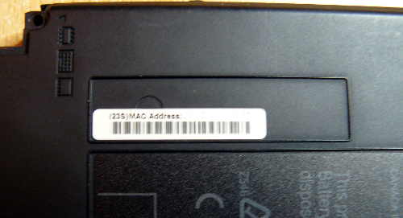 

Initial BBB configuration
=========================

Refer to [bbb\_setup.md](bbb_setup.md) for how to configure the BBB
for flashing.

The following shows how to connect clip to the BBB (on the P9 header),
for SOIC-16 (clip: Pomona 5252):

    POMONA 5252 (correlate with the BBB guide)
    ===  ethernet jack and VGA port ====
     NC              -       - 21
     1               -       - 17
     NC              -       - NC
     NC              -       - NC
     NC              -       - NC
     NC              -       - NC
     18              -       - 3.3V (PSU)
     22              -       - NC - this is pin 1 on the flash chip
    ===  SATA port ===
    This is how you will connect. Numbers refer to pin numbers on the BBB, on the plugs near the DC jack.

The following shows how to connect clip to the BBB (on the P9 header),
for SOIC-8 (clip: Pomona 5250):

    POMONA 5250 (correlate with the BBB guide)
    ===  RAM slots ====
     18              -       - 1
     22              -       - NC
     NC              -       - 21
     3.3V (PSU)      -       - 17 - this is pin 1 on the flash chip
    ===  slot where the AC jack is connected ===

    This is how you will connect. Numbers refer to pin numbers on the BBB, on the plugs near the DC jack.

The procedure
-------------

Remove all screws:\
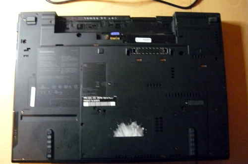\
It is also advisable to, throughout the disassembly, place any screws
and/or components that you removed in the same layout or arrangement.
The follow photos demonstrate this:\
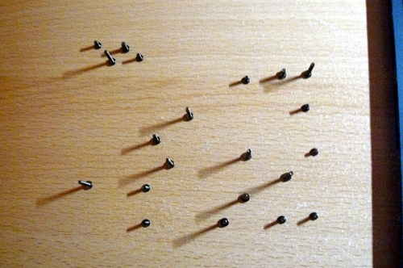 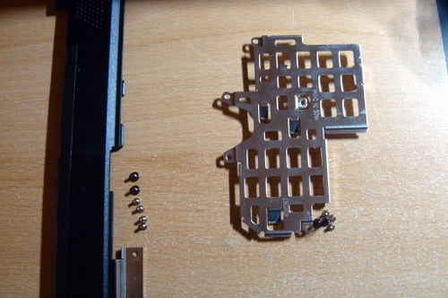

Remove the HDD/SSD and optical drive:\
 

Remove the palm rest:\
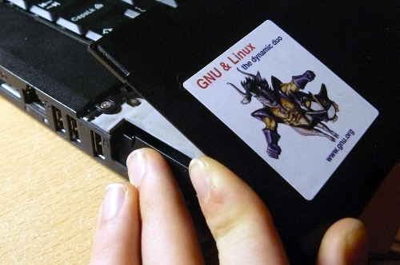 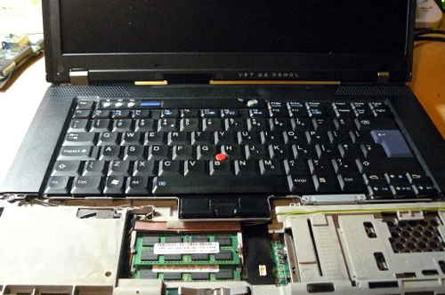

Remove the keyboard and rear bezel:\
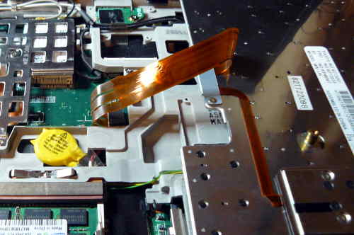 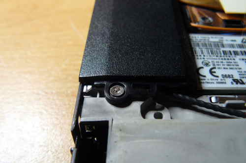
 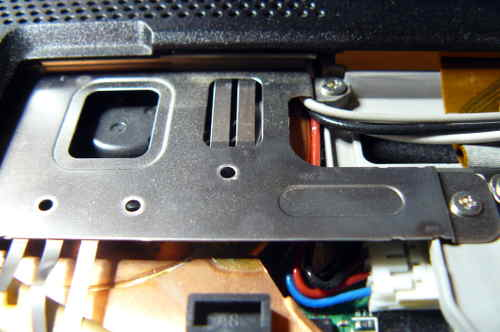
 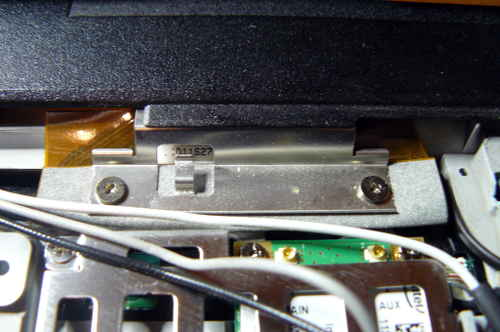

If you have a WWAN/3G card and/or sim card reader, remove them
permanently. The WWAN-3G card has proprietary firmware inside; the
technology is identical to what is used in mobile phones, so it can also
track your movements:\
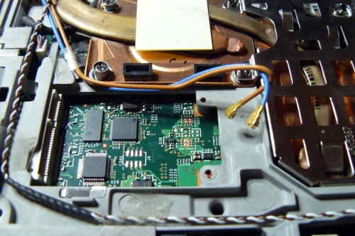 

Remove this frame, and then remove the wifi chip:\
 
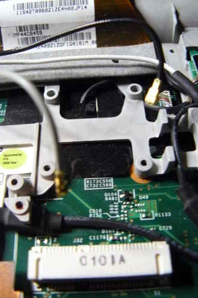

Remove the speakers:\
 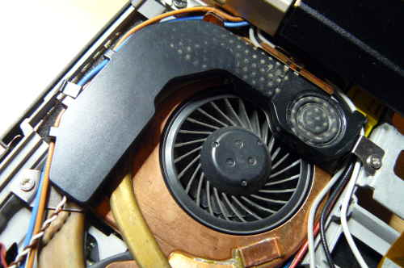
 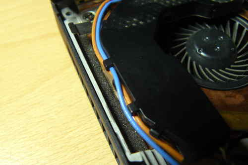
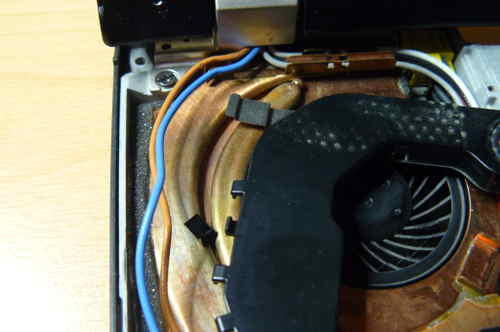 
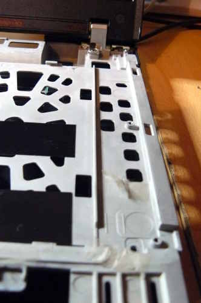

Remove the NVRAM battery (already removed in this photo):\

When you re-assemble, you will be replacing the wifi chip with another.
These two screws don't hold anything together, but they are included in
your system because the screw holes for half-height cards are a
different size, so use these if you will be installing a half-height
card:\

Unroute the antenna wires:\
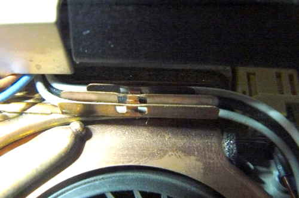 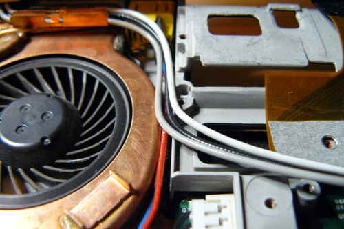
 

Disconnect the LCD cable from the motherboard:\
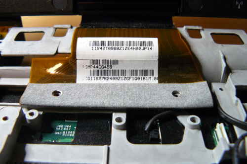 

Remove the LCD assembly hinge screws, and then remove the LCD assembly:\
 
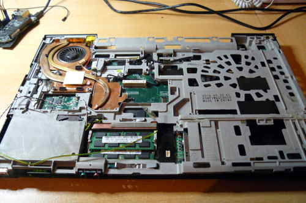

Remove the fan and heatsink:\
 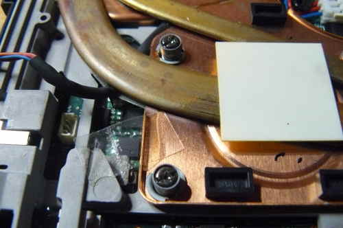

Remove this screw:\

Remove these cables, keeping note of how and in what arrangement they
are connected:\
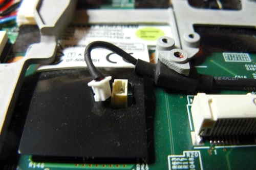 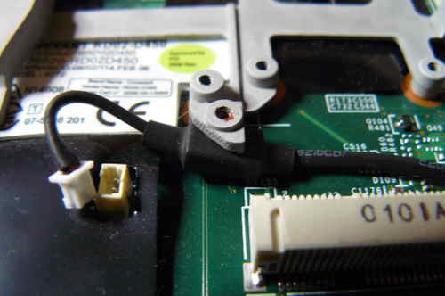
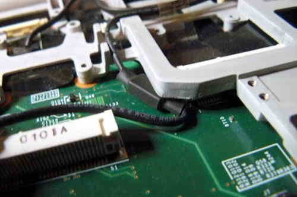 
 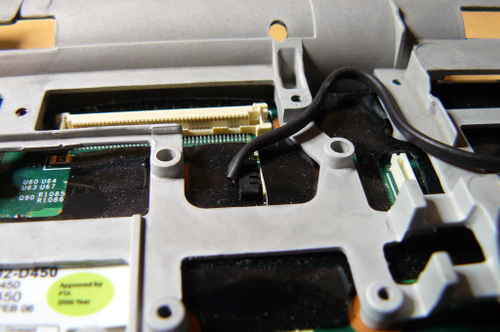
 

Disconnect the power jack:\
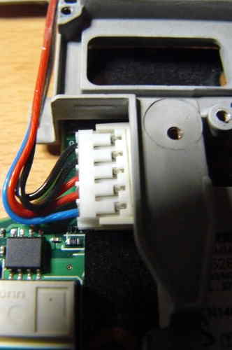 

Remove the motherboard and cage from the base (the marked hole is where
those cables were routed through):\
 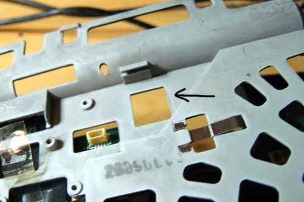

Remove all screws, arranging them in the same layout when placing the
screws on a surface and marking each screw hole (this is to reduce the
possibility of putting them back in the wrong holes):\
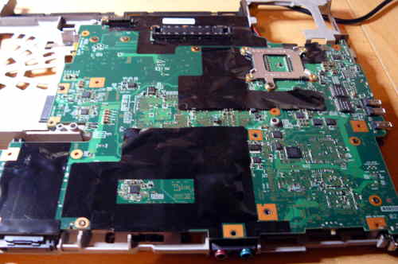 

Also remove this:\
 

Separate the motherboard from the cage:\
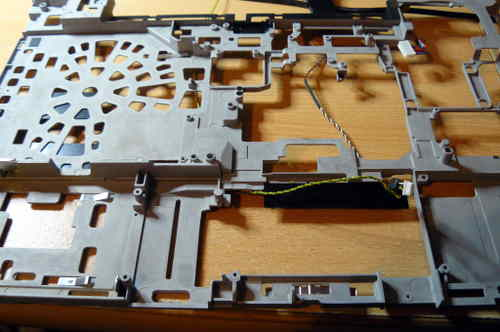 

The flash chip is next to the memory slots. On this system, it was a
SOIC-8 (4MiB or 32Mb) flash chip:\

Connect your programmer, then connect GND and 3.3V\
\
 
 

A dedicated 3.3V PSU was used to create this guide, but at ATX PSU is
also fine:\

Of course, make sure to turn on your PSU:\

Now, you should be ready to install libreboot.

Flashrom binaries for ARM (tested on a BBB) are distributed in
libreboot\_util. Alternatively, libreboot also distributes flashrom
source code which can be built.

Log in as root on your BBB, using the instructions in
[bbb\_setup.html\#bbb\_access](bbb_setup.html#bbb_access).

Test that flashrom works:
    # ./flashrom -p linux\_spi:dev=/dev/spidev1.0,spispeed=512
In this case, the output was:

    flashrom v0.9.7-r1854 on Linux 3.8.13-bone47 (armv7l)
    flashrom is free software, get the source code at http://www.flashrom.org
    Calibrating delay loop... OK.
    Found Macronix flash chip "MX25L6405(D)" (8192 kB, SPI) on linux_spi.
    Found Macronix flash chip "MX25L6406E/MX25L6436E" (8192 kB, SPI) on linux_spi.
    Found Macronix flash chip "MX25L6445E/MX25L6473E" (8192 kB, SPI) on linux_spi.
    Multiple flash chip definitions match the detected chip(s): "MX25L6405(D)", "MX25L6406E/MX25L6436E", "MX25L6445E/MX25L6473E"
    Please specify which chip definition to use with the -c <chipname> option.

How to backup factory.rom (change the -c option as neeed, for your flash
chip):

    # ./flashrom -p linux\_spi:dev=/dev/spidev1.0,spispeed=512 -r
factory.rom

    # ./flashrom -p linux\_spi:dev=/dev/spidev1.0,spispeed=512 -r
factory1.rom

    # ./flashrom -p linux\_spi:dev=/dev/spidev1.0,spispeed=512 -r
factory2.rom

\
Note: the **-c** option is not required in libreboot's patched
flashrom, because the redundant flash chip definitions in *flashchips.c*
have been removed.\
Now compare the 3 images:

    # sha512sum factory\*.rom
If the hashes match, then just copy one of them (the factory.rom) to a
safe place (on a drive connected to another system, not the BBB). This
is useful for reverse engineering work, if there is a desirable
behaviour in the original firmware that could be replicated in coreboot
and libreboot.

Follow the instructions at
[../hardware/gm45\_remove\_me.html\#ich9gen](../hardware/gm45_remove_me.html#ich9gen)
to change the MAC address inside the libreboot ROM image, before
flashing it. Although there is a default MAC address inside the ROM
image, this is not what you want. **Make sure to always change the MAC
address to one that is correct for your system.**

Now flash it:

    # ./flashrom -p linux\_spi:dev=/dev/spidev1.0,spispeed=512 -w
path/to/libreboot/rom/image.rom -V

You might see errors, but if it says **Verifying flash\... VERIFIED** at
the end, then it's flashed and should boot. If you see errors, try
again (and again, and again); the message **Chip content is identical to
the requested image** is also an indication of a successful
installation.

Example output from running the command (see above):

    flashrom v0.9.7-r1854 on Linux 3.8.13-bone47 (armv7l)
    flashrom is free software, get the source code at http://www.flashrom.org
    Calibrating delay loop... OK.
    Found Macronix flash chip "MX25L6405(D)" (8192 kB, SPI) on linux_spi.
    Reading old flash chip contents... done.
    Erasing and writing flash chip... FAILED at 0x00001000! Expected=0xff, Found=0x00, failed byte count from 0x00000000-0x0000ffff: 0xd716
    ERASE FAILED!
    Reading current flash chip contents... done. Looking for another erase function.
    Erase/write done.
    Verifying flash... VERIFIED.

Thermal paste (IMPORTANT)
=========================

Because part of this procedure involved removing the heatsink, you will
need to apply new paste. Arctic MX-4 is ok. You will also need isopropyl
alcohol and an anti-static cloth to clean with.

When re-installing the heatsink, you must first clean off all old paste
with the alcohol/cloth. Then apply new paste. Arctic MX-4 is also much
better than the default paste used on these systems.

NOTE: the photo above is for illustration purposes only, and does not
show how to properly apply the thermal paste. Other guides online detail
the proper application procedure.

Wifi
====

The T500 typically comes with an Intel wifi chipset, which does not work
without proprietary software. For a list of wifi chipsets that work
without proprietary software, see
[../hardware/\#recommended\_wifi](../hardware/#recommended_wifi).

Some T500 laptops might come with an Atheros chipset, but this is
802.11g only.

It is recommended that you install a new wifi chipset. This can only be
done after installing libreboot, because the original firmware has a
whitelist of approved chips, and it will refuse to boot if you use an
'unauthorized' wifi card.

The following photos show an Atheros AR5B95 being installed, to replace
the Intel chip that this T500 came with:\
 

WWAN
====

If you have a WWAN/3G card and/or sim card reader, remove them
permanently. The WWAN-3G card has DMA, and proprietary firmware inside;
the technology is identical to what is used in mobile phones, so it can
also track your movements.

Not to be confused with wifi (wifi is fine).

Memory
======

You need DDR3 SODIMM PC3-8500 RAM installed, in matching pairs
(speed/size). Non-matching pairs won't work. You can also install a
single module (meaning, one of the slots will be empty) in slot 0.

Make sure that the RAM you buy is the 2Rx8 density.

[This page](http://www.forum.thinkpads.com/viewtopic.php?p=760721) might
be useful for RAM compatibility info (note: coreboot raminit is
different, so this page might be BS)

The following photo shows 8GiB (2x4GiB) of RAM installed:\

Boot it!
--------

You should see something like this:

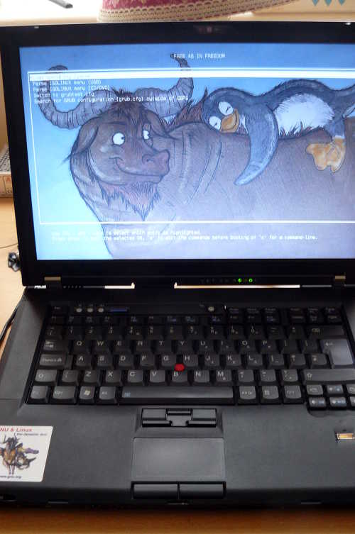

Now [install GNU+Linux](../gnulinux/).

Copyright © 2015 Leah Rowe <info@minifree.org>\

Permission is granted to copy, distribute and/or modify this document
under the terms of the GNU Free Documentation License Version 1.3 or any later
version published by the Free Software Foundation
with no Invariant Sections, no Front Cover Texts, and no Back Cover Texts.
A copy of this license is found in [../fdl-1.3.md](../fdl-1.3.md)
