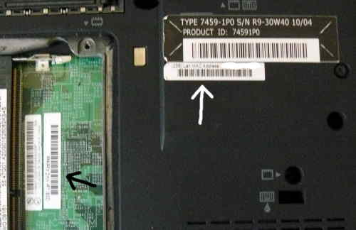
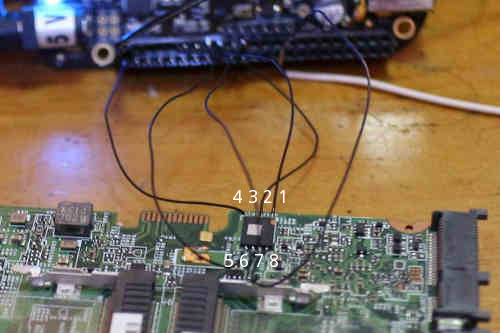
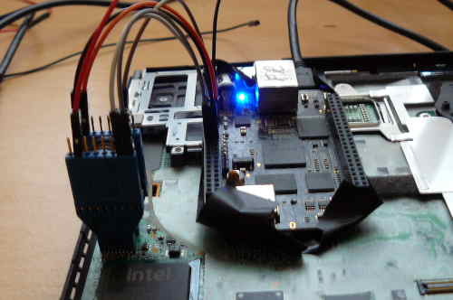
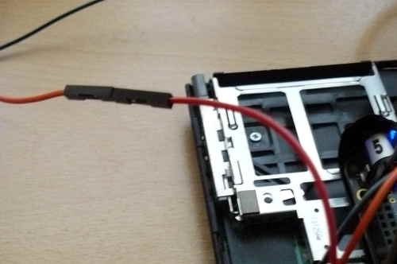
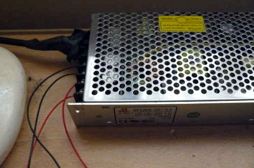
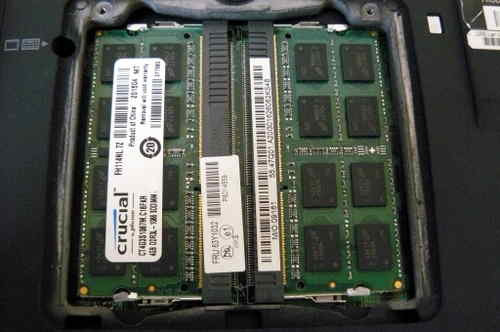
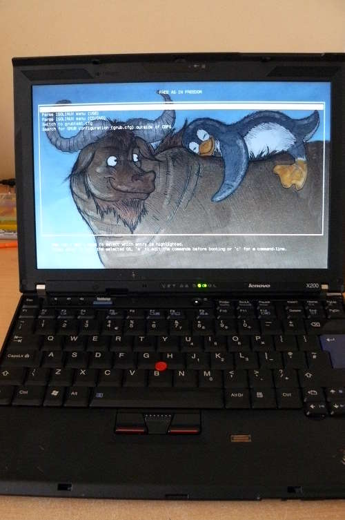
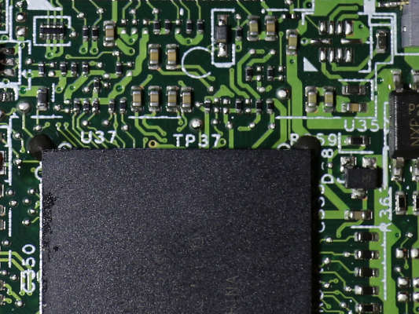

% Flashing the X200 with a BeagleBone Black 

Initial flashing instructions for X200.

This guide is for those who want libreboot on their ThinkPad X200 while
they still have the original Lenovo BIOS present. This guide can also be
followed (adapted) if you brick your X200, to know how to recover.

-   [X200 laptops with libreboot pre-installed](#preinstall)
-   [Flash chips](#flashchips)
-   [MAC address](#macaddress)
-   [Initial BBB configuration and installation procedure](#clip)
-   [Boot it!](#boot)
-   [Wifi](#wifi)
-   [wwan](#wwan)
-   [Memory](#memory)
-   [X200S and X200 Tablet users: GPIO33 trick will not work.](#gpio33)

X200 laptops with libreboot pre-installed {#preinstall}
=========================================

If you don't want to install libreboot yourself, companies exist that
sell these laptops with libreboot pre-installed, along with a free
GNU+Linux distribution.

Check the [suppliers](../../suppliers) page for more information.

Flash chip size {#flashchips}
===============

Use this to find out:
    # flashrom -p internal -V

The X200S and X200 Tablet will use a WSON-8 flash chip, on the bottom of
the motherboard (this requires removal of the motherboard). **Not all
X200S/X200T are supported; see
[../hcl/x200.html\#x200s](../hcl/x200.html#x200s).**

[Back to top of page.](#pagetop)

MAC address {#macaddress}
===========

On the X200/X200S/X200T, the MAC address for the onboard gigabit
ethernet chipset is stored inside the flash chip, along with other
configuration data.

Keep a note of the MAC address before disassembly; this is very
important, because you will need to insert this into the libreboot ROM
image before flashing it. It will be written in one of these locations:

Initial BBB configuration {#clip}
=========================

Refer to [bbb\_setup.html](bbb_setup.html) for how to set up the BBB for
flashing.

The following shows how to connect the clip to the BBB (on the P9
header), for SOIC-16 (clip: Pomona 5252):

    POMONA 5252 (correlate with the BBB guide)
    ===  front (display) on your X200 ====
     NC              -       - 21
     1               -       - 17
     NC              -       - NC
     NC              -       - NC
     NC              -       - NC
     NC              -       - NC
     18              -       - 3.3V (PSU)
     22              -       - NC - this is pin 1 on the flash chip
    ===  back (palmrest) on your X200 ===
    This is how you will connect. Numbers refer to pin numbers on the BBB, on the plugs near the DC jack.
    Here is a photo of the SOIC-16 flash chip. Pins are labelled:

                

The following shows how to connect the clip to the BBB (on the P9
header), for SOIC-8 (clip: Pomona 5250):

    POMONA 5250 (correlate with the BBB guide)
    ===  left side of the X200 (where the VGA port is) ====
     18              -       - 1
     22              -       - NC
     NC              -       - 21
     3.3V (PSU)      -       - 17 - this is pin 1 on the flash chip. in front of it is the screen.
    ===  right side of the X200 (where the audio jacks are) ===
    This is how you will connect. Numbers refer to pin numbers on the BBB, on the plugs near the DC jack.
    Here is a photo of the SOIC-8 flash chip. The pins are labelled:

    Look at the pads in that photo, on the left and right. Those are for SOIC-16. Would it be possible to remove the SOIC-8 and solder a SOIC-16
    chip on those pins?

**On the X200S and X200 Tablet the flash chip is underneath the board,
in a WSON package. The pinout is very much the same as a SOIC-8, except
you need to solder (there are no clips available).\
The following image shows how this is done:**\
\
In this image, a pin header was soldered onto the WSON. Another solution
might be to de-solder the WSON-8 chip and put a SOIC-8 there instead.
Check the list of SOIC-8 flash chips at
[../hcl/gm45\_remove\_me.html\#flashchips](../hcl/gm45_remove_me.html#flashchips)
but do note that these are only 4MiB (32Mb) chips. The only X200 SPI
chips with 8MiB capacity are SOIC-16. For 8MiB capacity in this case,
the X201 SOIC-8 flash chip (Macronix 25L6445E) might work.

The procedure
-------------

This section is for the X200. This does not apply to the X200S or X200
Tablet (for those systems, you have to remove the motherboard
completely, since the flash chip is on the other side of the board).

Remove these screws:\

Push the keyboard forward, gently, then lift it off and disconnect it
from the board:\

Pull the palm rest off, lifting from the left and right side at the back
of the palm rest:\

Lift back the tape that covers a part of the flash chip, and then
connect the clip:\

On pin 2 of the BBB, where you have the ground (GND), connect the ground
to your PSU:\

Connect the 3.3V supply from your PSU to the flash chip (via the clip):\

Of course, make sure that your PSU is also plugged in and turn on:\

This tutorial tells you to use an ATX PSU, for the 3.3V DC supply. The
PSU used when taking these photos is actually not an ATX PSU, but a PSU
that is designed specifically for providing 3.3V DC (an ATX PSU will
also work):\

Now, you should be ready to install libreboot.

Flashrom binaries for ARM (tested on a BBB) are distributed in
libreboot\_util. Alternatively, libreboot also distributes flashrom
source code which can be built.

Log in as root on your BBB, using the instructions in
[bbb\_setup.html\#bbb\_access](bbb_setup.html#bbb_access).

Test that flashrom works:
    # ./flashrom -p linux\_spi:dev=/dev/spidev1.0,spispeed=512
In this case, the output was:

    flashrom v0.9.7-r1854 on Linux 3.8.13-bone47 (armv7l)
    flashrom is free software, get the source code at http://www.flashrom.org
    Calibrating delay loop... OK.
    Found Macronix flash chip "MX25L6405(D)" (8192 kB, SPI) on linux_spi.
    Found Macronix flash chip "MX25L6406E/MX25L6436E" (8192 kB, SPI) on linux_spi.
    Found Macronix flash chip "MX25L6445E/MX25L6473E" (8192 kB, SPI) on linux_spi.
    Multiple flash chip definitions match the detected chip(s): "MX25L6405(D)", "MX25L6406E/MX25L6436E", "MX25L6445E/MX25L6473E"
    Please specify which chip definition to use with the -c <chipname> option.

How to backup factory.rom (change the -c option as neeed, for your flash
chip):\
\# **./flashrom -p linux\_spi:dev=/dev/spidev1.0,spispeed=512 -r
factory.rom**\
\# **./flashrom -p linux\_spi:dev=/dev/spidev1.0,spispeed=512 -r
factory1.rom**\
\# **./flashrom -p linux\_spi:dev=/dev/spidev1.0,spispeed=512 -r
factory2.rom**\
Note: the **-c** option is not required in libreboot's patched
flashrom, because the redundant flash chip definitions in *flashchips.c*
have been removed.\
Now compare the 3 images:\
    # sha512sum factory\*.rom
If the hashes match, then just copy one of them (the factory.rom) to a
safe place (on a drive connected to another system, not the BBB). This
is useful for reverse engineering work, if there is a desirable
behaviour in the original firmware that could be replicated in coreboot
and libreboot.

Follow the instructions at
[../hcl/gm45\_remove\_me.html\#ich9gen](../hcl/gm45_remove_me.html#ich9gen)
to change the MAC address inside the libreboot ROM image, before
flashing it. Although there is a default MAC address inside the ROM
image, this is not what you want. **Make sure to always change the MAC
address to one that is correct for your system.**

Now flash it:\
\# **./flashrom -p linux\_spi:dev=/dev/spidev1.0,spispeed=512 -w
path/to/libreboot/rom/image.rom -V**

You might see errors, but if it says **Verifying flash\... VERIFIED** at
the end, then it's flashed and should boot. If you see errors, try
again (and again, and again); the message **Chip content is identical to
the requested image** is also an indication of a successful
installation.

Example output from running the command (see above):

    flashrom v0.9.7-r1854 on Linux 3.8.13-bone47 (armv7l)
    flashrom is free software, get the source code at http://www.flashrom.org
    Calibrating delay loop... OK.
    Found Macronix flash chip "MX25L6405(D)" (8192 kB, SPI) on linux_spi.
    Reading old flash chip contents... done.
    Erasing and writing flash chip... FAILED at 0x00001000! Expected=0xff, Found=0x00, failed byte count from 0x00000000-0x0000ffff: 0xd716
    ERASE FAILED!
    Reading current flash chip contents... done. Looking for another erase function.
    Erase/write done.
    Verifying flash... VERIFIED.

[Back to top of page.](#pagetop)

Wifi
====

The X200 typically comes with an Intel wifi chipset, which does not work
without proprietary software. For a list of wifi chipsets that work
without proprietary software, see
[../hcl/\#recommended\_wifi](../hcl/#recommended_wifi).

Some X200 laptops come with an Atheros chipset, but this is 802.11g
only.

It is recommended that you install a new wifi chipset. This can only be
done after installing libreboot, because the original firmware has a
whitelist of approved chips, and it will refuse to boot if you use an
'unauthorized' wifi card.

The following photos show an Atheros AR5B95 being installed, to replace
the Intel chip that this X200 came with:\

WWAN
====

If you have a WWAN/3G card and/or sim card reader, remove them
permanently. The WWAN-3G card has proprietary firmware inside; the
technology is identical to what is used in mobile phones, so it can also
track your movements.

Not to be confused with wifi (wifi is fine).

Memory
======

You need DDR3 SODIMM PC3-8500 RAM installed, in matching pairs
(speed/size). Non-matching pairs won't work. You can also install a
single module (meaning, one of the slots will be empty) in slot 0.

NOTE: according to users repors, non matching pairs (e.g. 1+2 GiB) might
work in some cases.

Make sure that the RAM you buy is the 2Rx8 density.

In this photo, 8GiB of RAM (2x4GiB) is installed:\

Boot it! {#boot}
--------

You should see something like this:

Now [install GNU+Linux](../gnulinux/).

X200S and X200 Tablet users: GPIO33 trick will not work. {#gpio33}
--------------------------------------------------------

sgsit found out about a pin called GPIO33, which can be grounded to
disable the flashing protections by the descriptor and stop the ME from
starting (which itself interferes with flashing attempts). The theory
was proven correct; however, it is still useless in practise.

Look just above the 7 in TP37 (that's GPIO33):\

By default we would see this in lenovobios, when trying flashrom -p
internal -w rom.rom:

    FREG0: Warning: Flash Descriptor region (0x00000000-0x00000fff) is read-only.
    FREG2: Warning: Management Engine region (0x00001000-0x005f5fff) is locked.

With GPIO33 grounded during boot, this disabled the flash protections as
set by descriptor, and stopped the ME from starting. The output changed
to:

    The Flash Descriptor Override Strap-Pin is set. Restrictions implied by
    the Master Section of the flash descriptor are NOT in effect. Please note
    that Protected Range (PR) restrictions still apply.

The part in bold is what got us. This was still observed:

    PR0: Warning: 0x007e0000-0x01ffffff is read-only.
    PR4: Warning: 0x005f8000-0x005fffff is locked.

It is actually possible to disable these protections. Lenovobios does,
when updating the BIOS (proprietary one). One possible way to go about
this would be to debug the BIOS update utility from Lenovo, to find out
how it's disabling these protections. Some more research is available
here:
<http://www.coreboot.org/Board:lenovo/x200/internal_flashing_research>

On a related note, libreboot has a utility that could help with
investigating this:
[../hcl/gm45\_remove\_me.html\#demefactory](../hcl/gm45_remove_me.html#demefactory)

Copyright © 2014, 2015 Leah Rowe <info@minifree.org>\
Permission is granted to copy, distribute and/or modify this document
under the terms of the Creative Commons Attribution-ShareAlike 4.0
International license or any later version published by Creative
Commons; A copy of the license can be found at
[../cc-by-sa-4.0.txt](../cc-by-sa-4.0.txt)

Updated versions of the license (when available) can be found at
<https://creativecommons.org/licenses/by-sa/4.0/legalcode>

UNLESS OTHERWISE SEPARATELY UNDERTAKEN BY THE LICENSOR, TO THE EXTENT
POSSIBLE, THE LICENSOR OFFERS THE LICENSED MATERIAL AS-IS AND
AS-AVAILABLE, AND MAKES NO REPRESENTATIONS OR WARRANTIES OF ANY KIND
CONCERNING THE LICENSED MATERIAL, WHETHER EXPRESS, IMPLIED, STATUTORY,
OR OTHER. THIS INCLUDES, WITHOUT LIMITATION, WARRANTIES OF TITLE,
MERCHANTABILITY, FITNESS FOR A PARTICULAR PURPOSE, NON-INFRINGEMENT,
ABSENCE OF LATENT OR OTHER DEFECTS, ACCURACY, OR THE PRESENCE OR ABSENCE
OF ERRORS, WHETHER OR NOT KNOWN OR DISCOVERABLE. WHERE DISCLAIMERS OF
WARRANTIES ARE NOT ALLOWED IN FULL OR IN PART, THIS DISCLAIMER MAY NOT
APPLY TO YOU.

TO THE EXTENT POSSIBLE, IN NO EVENT WILL THE LICENSOR BE LIABLE TO YOU
ON ANY LEGAL THEORY (INCLUDING, WITHOUT LIMITATION, NEGLIGENCE) OR
OTHERWISE FOR ANY DIRECT, SPECIAL, INDIRECT, INCIDENTAL, CONSEQUENTIAL,
PUNITIVE, EXEMPLARY, OR OTHER LOSSES, COSTS, EXPENSES, OR DAMAGES
ARISING OUT OF THIS PUBLIC LICENSE OR USE OF THE LICENSED MATERIAL, EVEN
IF THE LICENSOR HAS BEEN ADVISED OF THE POSSIBILITY OF SUCH LOSSES,
COSTS, EXPENSES, OR DAMAGES. WHERE A LIMITATION OF LIABILITY IS NOT
ALLOWED IN FULL OR IN PART, THIS LIMITATION MAY NOT APPLY TO YOU.

The disclaimer of warranties and limitation of liability provided above
shall be interpreted in a manner that, to the extent possible, most
closely approximates an absolute disclaimer and waiver of all liability.

